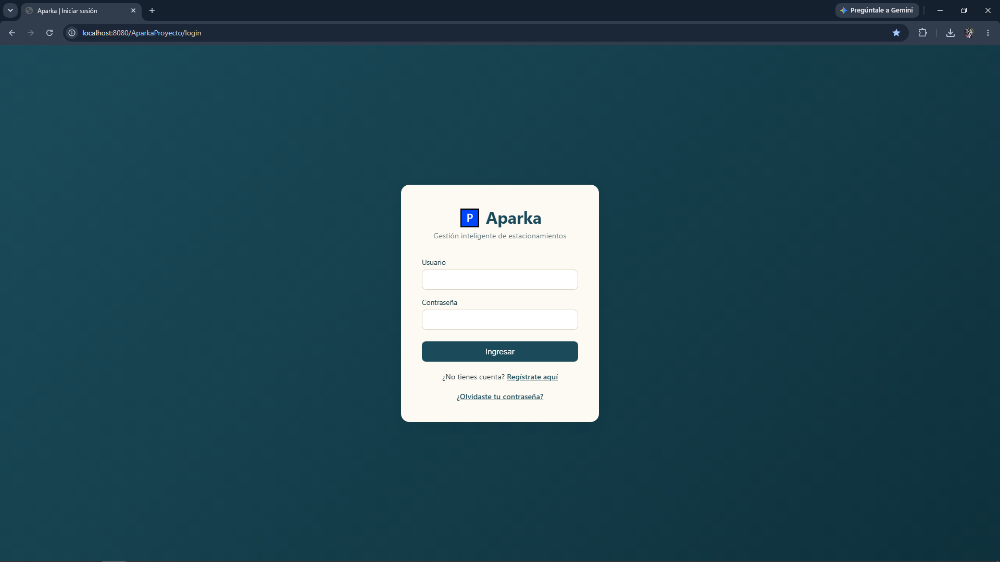
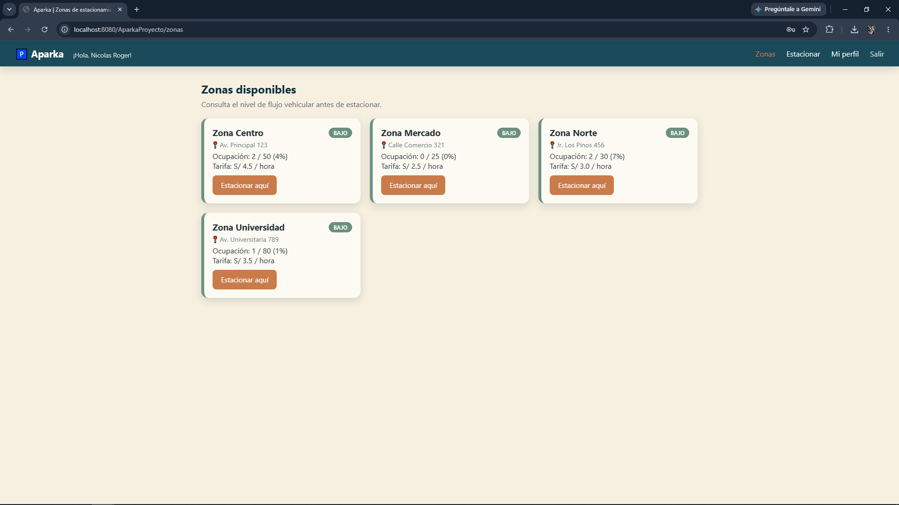
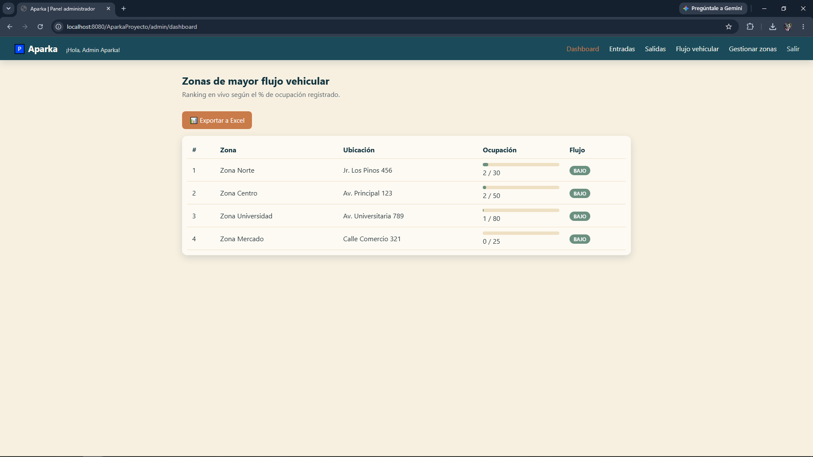

# Aparka — Sistema de Gestión de Estacionamientos

Sistema web para la gestión de estacionamientos, orientado a **identificar las zonas de mayor flujo vehicular** en tiempo real, optimizando tanto la experiencia del conductor como la administración de espacios disponibles.

## Descripción del proyecto

**Aparka** resuelve un problema común: los conductores no saben qué zonas de estacionamiento tienen espacio disponible antes de dirigirse a ellas, y los administradores no tienen visibilidad clara de qué zonas presentan mayor demanda.

El sistema calcula automáticamente un **nivel de flujo vehicular** (Bajo / Medio / Alto) por cada zona, en base a su ocupación actual respecto a su capacidad total, permitiendo:
- A los **conductores**, elegir dónde estacionar con información en tiempo real.
- A los **administradores**, identificar patrones de alta demanda y gestionar la operación (ingresos, salidas, zonas, reportes).

## Funcionalidades

| Módulo | Descripción |
|---|---|
| Autenticación | Login, registro de usuarios y recuperación de contraseña |
| Usuario final | Consulta de zonas disponibles con nivel de flujo, autoregistro de ingreso vehicular, perfil |
| Operación (admin) | Registrar ingreso y salida de cualquier vehículo (con ticket automático) |
| Análisis (admin) | Dashboard con ranking de flujo vehicular, consulta filtrable de movimientos, exportación a Excel |
| Configuración (admin) | Gestión (CRUD) de zonas de estacionamiento |

## Capturas de pantalla

| Login | Zonas disponibles | Dashboard admin |
|---|---|---|
|  |  |  |

## Stack tecnológico

- **Backend:** Java (Servlets + JSP), arquitectura MVC
- **Base de datos:** MySQL
- **Frontend:** HTML5, CSS3, JavaScript
- **Build:** Apache Maven
- **Servidor:** Apache Tomcat 11 (Jakarta EE 10 / Servlet 6.0)
- **Librerías de apoyo:**
  - [Google Guava](https://github.com/google/guava) — validaciones defensivas (`Preconditions`)
  - [Apache Commons Lang3](https://commons.apache.org/proper/commons-lang/) / [Commons Validator](https://commons.apache.org/proper/commons-validator/) — validación de formularios
  - [Apache POI](https://poi.apache.org/) — generación de reportes en Excel
  - [Logback](https://logback.qos.ch/) — logging de eventos de seguridad y auditoría
- **Pruebas:** JUnit 5 (30 pruebas unitarias)
- **Control de versiones:** Git / GitHub

## Arquitectura

Patrón **MVC en capas**, con separación clara de responsabilidades:

```
com.aparka.controller   → Servlets (Controller): reciben peticiones HTTP y coordinan la respuesta
com.aparka.service      → Lógica de negocio (ej. cálculo del nivel de flujo vehicular)
com.aparka.dao          → Acceso a datos (JDBC + PreparedStatement)
com.aparka.model        → Entidades del dominio (Usuario, Zona, Entrada, etc.)
com.aparka.util         → Utilidades transversales (conexión BD, filtros de seguridad, validaciones)
webapp/views            → Vistas JSP + JSTL
```

**Principios aplicados:**
- **MVC**: separación entre Controller (Servlets), Model (entidades) y View (JSP).
- **DAO**: acceso a datos encapsulado, sin SQL disperso en los controladores.
- **SOLID**: cada clase tiene una responsabilidad única (ej. `ZonaService` no sabe de HTTP, `ZonaDAO` no sabe de reglas de negocio).
- **Seguridad**: control de acceso por rol (`RoleFilter`), validación de formularios en el backend, registro de auditoría (Logback).

## Base de datos

La base de datos `Parking` incluye 9 tablas (`CentroComercial`, `Rol`, `UsuarioSistema`, `CajaMaster`, `PuertaMaster`, `Zona`, `Venta`, `Entrada`, `Salida`). Diagrama ER y script completo en [`schema.sql`](./schema.sql).

## Equipo

| Integrante | Rol |
|---|---|
| Nicolas| Frontend / Diseño UI-UX |
| Wilbor | Backend / Base de datos |

## Instalación y ejecución local

<details>
<summary>Ver guía completa de instalación</summary>

### Requisitos previos
- JDK 17 o superior
- Apache Maven
- Apache Tomcat 11
- MySQL

### 1. Clonar el repositorio
```bash
git clone https://github.com/Nicolas130599/AparkaProyecto.git
cd AparkaProyecto
```

### 2. Configurar la base de datos
1. Ejecuta el script [`schema.sql`](./schema.sql) en tu MySQL — crea la base de datos `Parking` completa con datos de ejemplo.
2. Abre `src/main/java/com/aparka/util/ConexionBD.java` y actualiza tu URL, usuario y contraseña:
   ```java
   private static final String URL = "jdbc:mysql://localhost:3306/Parking?useSSL=false&serverTimezone=UTC";
   private static final String USUARIO = "root";
   private static final String PASSWORD = "TU_PASSWORD_AQUI";
   ```

### 3. Compilar y desplegar
```bash
mvn clean package
# copia target/AparkaProyecto.war a la carpeta webapps/ de tu Tomcat
```
Inicia Tomcat y abre: `http://localhost:8080/AparkaProyecto/login`

### 4. Cuentas de prueba
| Rol | Usuario | Contraseña |
|---|---|---|
| Administrador | `admin` | `admin123` |
| Usuario | `demo` | `demo123` |

### Solución de problemas comunes

| Error / síntoma | Causa probable | Solución |
|---|---|---|
| `NoClassDefFoundError: javax/servlet/...` | Código antiguo (javax) en Tomcat 11 | Usa el código actual (namespace `jakarta`) |
| "Unsupported class file major version" | JDK incompatible | Instala JDK 17+ |
| `HTTP Status 404` en `/login` | Contexto incorrecto | Verifica la URL: `http://localhost:8080/AparkaProyecto/login` |
| `ClassNotFoundException: com.mysql.cj.jdbc.Driver` | Falta el conector MySQL | Corre `mvn clean package` para empaquetar la dependencia |
| `Communications link failure` | BD no está corriendo o mal configurada | Revisa que MySQL esté activo y los datos en `ConexionBD.java` |

</details>

## Pruebas

El proyecto incluye 30 pruebas unitarias (JUnit 5) sobre la lógica de cálculo de flujo vehicular y las validaciones de formularios:
```bash
mvn test
```

## Próximos pasos

- [ ] Hashear contraseñas (actualmente en texto plano, simplificación académica)
- [ ] Pantalla de gestión de usuarios del sistema (admin)
- [ ] Mapa visual de zonas
- [ ] Migración opcional a Spring MVC si el proyecto escala

---
_Proyecto académico — Sistema de Gestión de Estacionamientos Aparka._
